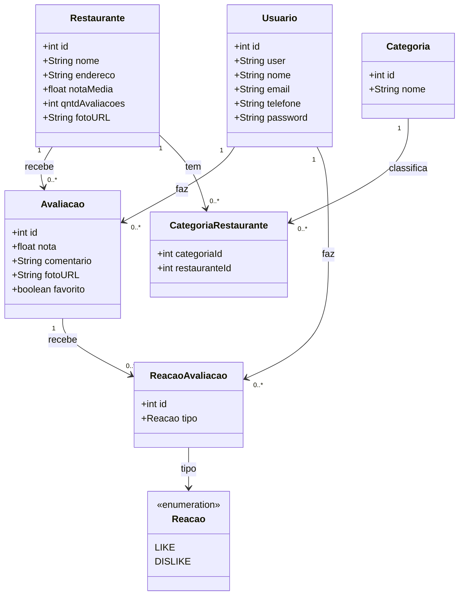

# 🍽️ Dishd

[](LICENSE)


> Plataforma social *mobile-first* para curar e registrar experiências gastronômicas na Grande Vitória.

O **Dishd** transforma o ato de comer fora em um diário pessoal e social. Inspirado no modelo
de *journaling* do Letterboxd, ele permite que entusiastas da culinária capixaba registrem
visitas, deem notas, escrevam comentários, montem listas de roteiros e acompanhem um feed
social de amigos — tudo em uma interface elegante e otimizada para celular.

Projeto desenvolvido para a disciplina **Projeto Integrado** da **UFES**.

---

## 📑 Sumário

- [Sobre o projeto](#-sobre-o-projeto)
- [Funcionalidades](#-funcionalidades)
- [Diagrama de classes do domínio](#-diagrama-de-classes-do-domínio)
- [Frameworks reutilizados](#-frameworks-reutilizados)
- [Ferramentas escolhidas](#-ferramentas-escolhidas)
- [Estrutura do repositório](#-estrutura-do-repositório)
- [Como executar o sistema](#-como-executar-o-sistema)
- [Como gerar a documentação do código](#-como-gerar-a-documentação-do-código)
- [Design](#-design)
- [Equipe](#-equipe)
- [Licença](#-licença)

---

## 📖 Sobre o projeto

| | |
|---|---|
| **Nome** | Dishd |
| **Público-alvo** | Entusiastas da gastronomia capixaba que querem descobrir, catalogar, avaliar e compartilhar experiências culinárias. |
| **Tipo** | Aplicação web *mobile-first* (PWA) com backend REST. |
| **Região de foco** | Grande Vitória (ES). |

A proposta completa do projeto está em
[`docs/[Projeto Integrado] Proposta de Projeto.txt`](docs/%5BProjeto%20Integrado%5D%20Proposta%20de%20Projeto.txt).

## ✨ Funcionalidades

- 📓 **Diário interativo** — registrar visitas a restaurantes com nota, comentário e foto.
- ⭐ **Avaliações** — atribuir notas e marcar favoritos.
- 👍 **Reações** — curtir (*like*) ou não curtir (*dislike*) avaliações de outros usuários.
- 🗂️ **Categorias** — organizar restaurantes por tipo de cozinha / categoria.
- 📰 **Feed social** — acompanhar as atividades de amigos.
- 📊 **Estatísticas** — visualizar hábitos de consumo do usuário.

## 🧩 Diagrama de classes do domínio

O diagrama abaixo é renderizado automaticamente pelo GitHub (Mermaid). A fonte em **PlantUML**
está em [`docs/model.wsd`](docs/model.wsd).



**Entidades principais**

- **Usuario** — pessoa cadastrada na plataforma.
- **Restaurante** — estabelecimento avaliado, com nota média e quantidade de avaliações.
- **Avaliacao** — registro que um usuário faz sobre um restaurante (nota, comentário, foto).
- **ReacaoAvaliacao** — curtida/descurtida de um usuário sobre uma avaliação.
- **Categoria** + **CategoriaRestaurante** — relação *muitos-para-muitos* entre restaurantes e categorias.

## 🛠️ Frameworks reutilizados

| Camada | Framework / Biblioteca | Função |
|---|---|---|
| **Frontend** | [Next.js](https://nextjs.org/) (React) | Framework web, roteamento e renderização. |
| | [React](https://react.dev/) | Construção da interface por componentes. |
| | [Tailwind CSS](https://tailwindcss.com/) | Estilização utilitária *mobile-first*. |
| | PWA | Instalação e uso como app no celular. |
| **Backend** | [Spring Boot](https://spring.io/projects/spring-boot) | Framework principal da API REST. |
| | Spring Web | Endpoints REST. |
| | Spring Data JPA / Hibernate | Persistência e mapeamento objeto-relacional. |
| | Spring Security | Autenticação e autorização. |
| **Banco** | [PostgreSQL](https://www.postgresql.org/) | Banco de dados relacional. |

**Linguagens:** TypeScript (frontend) e Java 17 (backend).

## 🧰 Ferramentas escolhidas

| Categoria | Ferramenta | Por quê |
|---|---|---|
| **Controle de versão** | Git + [GitHub](https://github.com/Eduardo-Ferraz/dishd) | Padrão da indústria, integra com as demais ferramentas. |
| **Build (backend)** | [Maven](https://maven.apache.org/) | Gerenciamento de dependências e build do Spring Boot. |
| **Build (frontend)** | npm + [Node.js](https://nodejs.org/) | Gerenciador de pacotes e scripts do Next.js. |
| **Testes (backend)** | JUnit 5 + Spring Boot Test + Mockito | Testes unitários e de integração. |
| **Testes (frontend)** | Jest + React Testing Library | Testes de componentes. |
| **Issue tracking** | GitHub Issues + GitHub Projects | Acompanhamento de tarefas e bugs, integrado ao repositório. |
| **CI/CD** | [GitHub Actions](https://github.com/features/actions) | Build e testes automáticos a cada *push* / *pull request*. |
| **Container** | [Docker](https://www.docker.com/) + Docker Compose | Ambiente reproduzível (app + banco) em um comando. |

## 📂 Estrutura do repositório

> ℹ️ O **backend já está implementado** (API REST completa). O `frontend/` em Next.js
> é o próximo passo planejado.

```text
dishd/
├── backend/            # ✅ API REST em Spring Boot (Java 17 + Maven) — ver backend/README.md
├── frontend/           # ⏳ App web em Next.js (TypeScript + Tailwind) — a implementar
├── docs/               # Documentação do projeto
│   ├── model.wsd       # Diagrama de classes (PlantUML)
│   ├── image.png       # Mockups de tela (Figma)
│   └── [Projeto Integrado] Proposta de Projeto.txt
├── docker-compose.yml  # Sobe backend + PostgreSQL com um comando
├── LICENSE
└── README.md
```

## 🚀 Como executar o sistema

### Pré-requisitos

- [Java JDK 17+](https://adoptium.net/)
- [Maven 3.9+](https://maven.apache.org/) (ou use o wrapper `./mvnw`)
- [Node.js 18+](https://nodejs.org/) e npm
- [PostgreSQL 15+](https://www.postgresql.org/) — ou [Docker](https://www.docker.com/)

### Opção 1 — Backend com banco em memória (mais rápida)

Não precisa instalar banco nenhum, só o Java. Sobe a API já com dados de exemplo:

```bash
cd backend
./mvnw spring-boot:run        # Windows: mvnw.cmd spring-boot:run
```

- API: <http://localhost:8080>
- Documentação interativa (Swagger): <http://localhost:8080/swagger-ui.html>
- Usuário de teste: `demo@dishd.com` / `demo1234`

### Opção 2 — Docker Compose (backend + PostgreSQL)

```bash
docker compose up --build
```

A API sobe em <http://localhost:8080> conectada a um PostgreSQL.

> Detalhes do backend — endpoints, perfis e autenticação JWT — em [`backend/README.md`](backend/README.md).
>
> O **frontend** (Next.js) ainda será implementado; quando existir, rodará em
> <http://localhost:3000> com `npm install && npm run dev`.

## 📚 Como gerar a documentação do código

### Backend — JavaDoc

```bash
cd backend
./mvnw javadoc:javadoc
```

A documentação HTML é gerada em `backend/target/site/apidocs/index.html`.

### Frontend — TypeDoc

```bash
cd frontend
npx typedoc --out docs-ts src
```

A documentação HTML é gerada em `frontend/docs-ts/index.html`.

## 🎨 Design

- **Protótipo no Figma:** [Dishd — PI](https://www.figma.com/design/AoAV5LVgo9GXlB0vNEJrzh/Dishd---PI?node-id=0-1)
- **Mockups das telas:**


## 👥 Equipe

- Eduardo Ferraz
- Mateus Biancardi
- Ricardo Modenese

## 📄 Licença

Distribuído sob a licença **MIT**. Veja [`LICENSE`](LICENSE) para mais detalhes.
